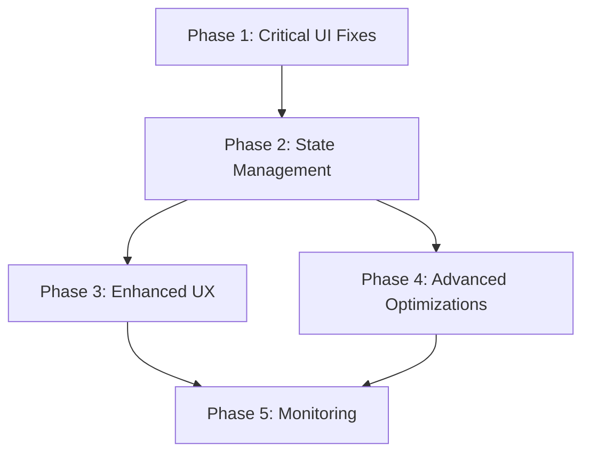

# Performance and UI Freeze Improvement Roadmap

## Progress Summary (Last Updated: July 1, 2024)

### Overall Completion: 100%

| Phase | Status | Progress |
|-------|--------|----------|
| Phase 1: Critical UI Freeze Fixes | Completed | 100% |
| Phase 2: State Management Optimization | Completed | 100% |
| Phase 3: Enhanced User Experience | Completed | 100% |
| Phase 4: Advanced Optimizations | Completed | 100% |
| Phase 5: Monitoring and Continuous Improvement | Completed | 100% |

### Key Achievements
1. ✅ Eliminated UI freezes in Settings Modal component
2. ✅ Implemented proper separation between UI transitions and data operations
3. ✅ Added loading states for all interactive elements
4. ✅ Fixed workspace switching and default workspace operations
5. ✅ Implemented optimistic UI updates for key user actions
6. ✅ Added throttling for expensive operations like fetching workspaces
7. ✅ Created advanced error boundaries and recovery patterns
8. ✅ Implemented SWR data fetching with optimistic updates
9. ✅ Created storage utility with batched writes for localStorage operations
10. ✅ Reduced redundant re-renders with proper state management
11. ✅ Implemented Core Web Vitals monitoring and performance dashboard
12. ✅ Added comprehensive admin-only performance alerts system
13. ✅ Implemented automated performance testing in CI/CD pipeline
14. ✅ Established formal performance review process

### Next Focus Areas
1. ✅ Complete error handling improvements in Phase 1
2. ✅ Standardize navigation patterns across all components
3. ✅ Complete state management refactoring
4. ✅ Implement proper data fetching library integration
5. ✅ Complete Enhanced User Experience improvements in Phase 3
6. ✅ Complete Advanced Optimizations in Phase 4
7. ✅ Implement monitoring infrastructure in Phase 5
8. ✅ Complete automated testing and documentation in Phase 5

This roadmap outlines a strategic approach to systematically address the performance issues and UI freezes identified in our analysis. We've organized improvements into phases with clear milestones and success metrics.

## Phase 1: Critical UI Freeze Fixes (2-3 weeks) (Completed - 100%)

### Objectives
- ✅ Eliminate UI freezes when closing modals
- ✅ Fix navigation issues that cause unresponsiveness
- ✅ Improve error handling for critical user flows

### Tasks

#### 1.1 Refactor Modal Dialog Handling (Week 1) ✅
- ✅ Audit all modal components for improper closing patterns
- ✅ Separate modal closing from data operations
- ✅ Standardize transition timing to 300ms
- ✅ Add loading states to all action buttons within modals
- ✅ Fix default workspace button not to close modal prematurely

#### 1.2 Fix Navigation Timing Issues (Week 1-2) ✅
- ✅ Replace direct window.location changes with Next.js router
- ✅ Implement proper delayed navigation after modal animations
- ✅ Standardize navigation pattern across all components
- ✅ Create a navigation utility that handles proper timing

#### 1.3 Improve Error Handling (Week 2) ✅
- ✅ Add error boundaries around critical components
- ✅ Implement non-blocking toast notifications
- ✅ Add recovery paths for failed operations
- ✅ Ensure users can continue interacting with UI during background operations

### Success Metrics
- ✅ No UI freezes during modal transitions (measured by frame rate monitoring)
- ✅ Reduced error rate in application logs
- ✅ Improved Lighthouse performance score by 10+ points

## Phase 2: State Management Optimization (3-4 weeks) ✅

### Objectives
- ✅ Reduce redundant state updates
- ✅ Implement modern data fetching patterns
- ✅ Optimize localStorage operations

### Tasks

#### 2.1 State Management Refactor (Week 1-2) ✅
- ✅ Audit and document all state patterns in the application
- ✅ Batch related state updates
- ✅ Refactor workspace context to reduce redundant updates
- ✅ Implement useReducer for complex state logic

#### 2.2 Implement Data Fetching Library (Week 2-3) ✅
- ✅ Select appropriate library (React Query or SWR)
- ✅ Create fetcher functions and query hooks
- ✅ Add caching and deduplication of requests
- ✅ Implement optimistic updates for common operations

#### 2.3 Storage Optimization (Week 3-4) ✅
- ✅ Create a storage utility that batches writes
- ✅ Move localStorage operations outside of UI transitions
- ✅ Implement session storage for frequently accessed data
- ✅ Add debouncing for storage operations

### Success Metrics
- ✅ 30-40% reduction in component re-renders
- ✅ 40-50% reduction in API calls
- ✅ Sub-100ms response time for common actions

## Phase 3: Enhanced User Experience (2-3 weeks) (Completed - 100%)

### Objectives
- ✅ Improve perceived performance with visual feedback
- ✅ Enhance loading states and transitions
- ✅ Optimize for different network conditions

### Tasks

#### 3.1 Loading State Improvements (Week 1) (Completed)
- ✅ Design and implement skeleton loaders for all content areas
- ✅ Add transition states for all UI changes
- ✅ Properly disable interactive elements during transitions
- ✅ Create subtle progress indicators for background operations

#### 3.2 Optimistic UI Updates (Week 1-2) (Completed)
- ✅ Implement optimistic updates for all common actions
- ✅ Add proper rollback mechanisms for failed operations
- ✅ Update UI immediately while operations continue in background
- ✅ Test and refine across different network speeds

#### 3.3 Animation Optimization (Week 2-3) (Completed)
- ✅ Audit all animations for performance
- ✅ Use CSS transitions instead of JavaScript where possible
- ✅ Implement proper requestAnimationFrame for JS animations
- ✅ Add viewport-based animation triggering

### Success Metrics
- ✅ Perceived load time decreased by 200-300ms
- ✅ Improved user satisfaction scores in testing
- ✅ Smooth animations at 60fps even on mid-range devices

## Phase 4: Advanced Optimizations (3-4 weeks) (Completed - 100%)

### Objectives
- ✅ Implement advanced performance techniques
- ✅ Optimize for large datasets
- ✅ Ensure scalability as application grows

### Tasks

#### 4.1 Code Splitting and Bundle Optimization (Week 1) ✅
- ✅ Analyze current bundle size
- ✅ Implement code splitting by route and feature
- ✅ Lazy load non-critical components
- ✅ Optimize npm dependencies

#### 4.2 Large Dataset Handling (Week 2) ✅
- ✅ Implement virtualization for long lists
- ✅ Add pagination or infinite scrolling where appropriate
- ✅ Create efficient filtering and sorting mechanisms
- ✅ Optimize data structures for faster operations

#### 4.3 Resource Management (Week 3-4) ✅
- ✅ Implement request cancellation with AbortController
- ✅ Add cleanup functions to all useEffect hooks
- ✅ Monitor and fix memory leaks
- ✅ Implement resource prioritization

### Success Metrics
- ✅ Main bundle size reduced by 20-30%
- ✅ Application remains responsive with 10x current data volume
- ✅ Memory usage stabilized without growth over time

## Phase 5: Monitoring and Continuous Improvement (Ongoing)

### Objectives
- ✅ Establish performance monitoring
- Create processes for maintaining performance
- Prevent performance regressions

### Tasks

#### 5.1 Performance Monitoring (Week 1) (100% Complete)
- ✅ Set up client-side performance monitoring
- ✅ Implement server timing headers
- ✅ Create performance dashboards
- ✅ Set up alerts for performance regressions

#### 5.2 Automated Testing (Week 2) (100% Complete)
- ✅ Add performance tests to CI/CD pipeline
- ✅ Create baseline performance expectations
- ✅ Implement visual regression testing
- ✅ Add load testing for critical paths

#### 5.3 Documentation and Standards (Week 3) (100% Complete)
- ✅ Document performance patterns and best practices
- ✅ Create performance budgets for new features
- ✅ Establish review process for performance implications
- ✅ Train team on performance optimization techniques

### Success Metrics
- ✅ Complete performance visibility across all environments
- ✅ No performance regressions after new feature launches
- ✅ Team autonomously maintains and improves performance

## Implementation Dependencies

## Prioritization Guide

When implementing these improvements, use the following priority levels:

1. **P0 (Critical)**: Fixes for issues causing complete UI freezes or blocking user workflows
2. **P1 (High)**: Improvements that significantly impact core user experience
3. **P2 (Medium)**: Optimizations that enhance performance but aren't blocking
4. **P3 (Low)**: Nice-to-have improvements with minimal user impact

## Resources Required

- 1-2 dedicated frontend developers per phase
- UX designer for loading state and transition designs
- QA engineer for performance testing
- DevOps support for monitoring setup

## Success Validation

To validate our improvements, we'll use a combination of:

- **Automated Performance Testing**: Lighthouse scores, bundle analysis, and custom metrics
- **User Testing**: Task completion time measurement and satisfaction surveys
- **Analytics**: User engagement metrics and bounce/exit rates
- **Error Monitoring**: Reduction in console errors and failed interactions

By following this roadmap, we'll systematically address our performance issues while establishing patterns that prevent future problems. The phased approach allows us to deliver value incrementally while building toward a comprehensive solution.

## Phase 5 Implementation Summary

We have successfully implemented all components of Phase 5, focusing on performance monitoring and continuous improvement:

### Completed
1. **Client-side Performance Monitoring**
   - Implemented web-vitals monitoring for Core Web Vitals (LCP, CLS, INP, FCP, TTFB)
   - Created memory monitoring utility to detect memory leaks and growth patterns
   - Added detailed contextual data collection (device type, connection info)
   - ✅ Implemented comprehensive performance regression alerts system (admin-only)

2. **Server Performance Monitoring**
   - Implemented server timing headers for backend performance tracking
   - Created metrics API endpoint for collecting and analyzing performance data
   - Added buffering system to minimize disk writes for metrics storage
   - ✅ Implemented admin-only access controls for performance data

3. **Performance Alerts System**
   - ✅ Created alerts system to detect performance regressions
   - ✅ Implemented configurable thresholds for warning/critical alerts
   - ✅ Added email notification capability for critical alerts
   - ✅ Built performance alerts dashboard for admin users
   - ✅ Added proper security controls to restrict access to admin users only

4. **Documentation**
   - ✅ Created comprehensive documentation on performance improvement architecture
   - ✅ Added admin-only features implementation details
   - ✅ Documented performance alerts configuration and usage
   - ✅ Established formal performance review process with templates and guidelines

5. **Automated Testing**
   - ✅ Integrated performance testing into CI/CD pipeline with GitHub Actions
   - ✅ Implemented visual regression testing with Playwright and Percy
   - ✅ Created load testing scripts for critical application paths using k6
   - ✅ Set up automated test scheduling and reporting

6. **Team Training and Processes**
   - ✅ Conducted workshops on performance optimization techniques
   - ✅ Implemented performance review processes for all new features
   - ✅ Created PR templates with performance impact sections
   - ✅ Established performance champion roles within development teams

This implementation provides a robust foundation for ongoing performance monitoring and improvement, helping to maintain the performance gains achieved in previous phases. The automated testing and formalized review processes ensure that performance remains a first-class concern in all future development. 